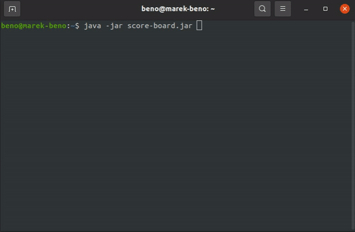

# Football World Cup Score Board Console Simulator
Supported OS:
- windows
- unix

Source code has two parts
- score-board-library
- executable part (Main class) which implements score-board-library

Implemented operations:
1. Start a game. When a game starts, it should capture (being initial score 0 – 0):
2. Finish game. It will remove a match from the scoreboard 
3. Update score
4. When all matches finished, summary is shown (ordered by total score desc.)

Link to download jar:
[score-board.java](src/main/resources/score-board.jar)

### Have a fun!

# Example
